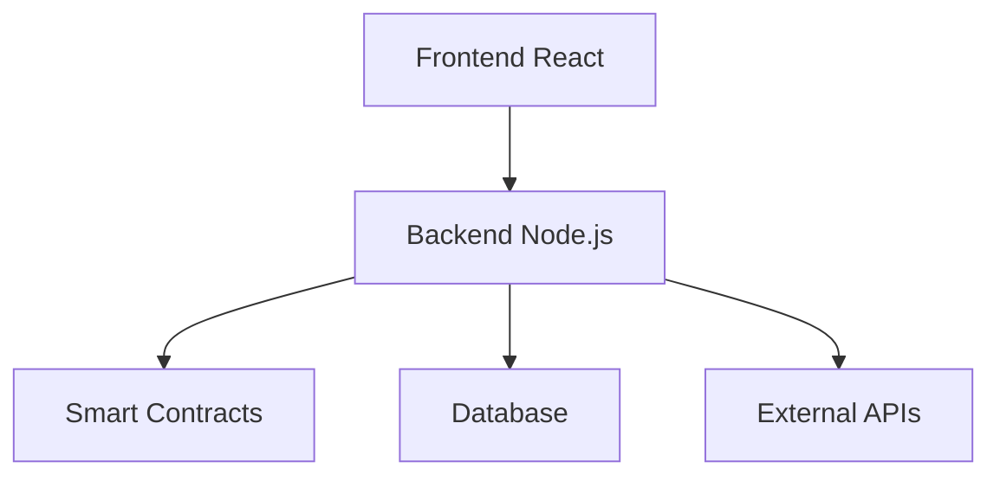

# Contributing to PayD

Thank you for your interest in contributing to PayD! This guide provides everything you need to start contributing effectively.

## Table of Contents
1. [Getting Started](#getting-started)
2. [Development Setup](#development-setup)
3. [Code Standards](#code-standards)
4. [Pull Request Process](#pull-request-process)
5. [Architecture Overview](#architecture-overview)
6. [Testing Guide](#testing-guide)
7. [Documentation](#documentation)

## Getting Started

### Prerequisites
- Node.js (v16+) and npm/yarn
- Git
- Docker (optional, for full-stack testing)
- Solidity compiler (for contract development)

### Forking and Cloning
```bash
git clone https://github.com/your-username/PayD.git
cd PayD
git checkout -b feature/your-feature-name
```

## Development Setup

### Backend Setup
```bash
cd backend
npm install
cp .env.example .env
# Edit .env with your database credentials
npm run dev
```

### Frontend Setup
```bash
cd frontend
npm install
npm run dev
```

### Smart Contracts
```bash
cd contracts
npm install
npm run compile
npm run test
```

## Code Standards

### Formatting
- **Backend**: Prettier + ESLint
- **Frontend**: Prettier + ESLint
- **Contracts**: Solidity formatter

### Naming Conventions
- Variables: `camelCase`
- Functions: `camelCase`
- Constants: `UPPER_CASE`
- Components: `PascalCase`

### Documentation
- JSDoc for all functions
- Require comments for complex logic
- Keep functions under 50 lines

## Pull Request Process

### PR Template
Use the provided template in `.github/PULL_REQUEST_TEMPLATE.md`

### Review Criteria
1. Code follows project standards
2. Tests cover new functionality
3. Documentation updated
4. No console.log statements
5. Database migrations included if needed

### Workflow
1. Update feature branch
2. Ensure tests pass
3. Create PR targeting `main`
4. Address review feedback
5. Squash and merge

## Architecture Overview

### High-Level Diagram


### Key Components
- **Frontend**: React + TypeScript
- **Backend**: Express + JWT
- **Contracts**: Solidity (Ethereum)
- **Database**: PostgreSQL
- **Storage**: IPFS

## Testing Guide

### Unit Tests
```bash
npm run test:unit
```

### Integration Tests
```bash
npm run test:integration
```

### E2E Tests
```bash
npm run test:e2e
```

### Contract Tests
```bash
cd contracts && npm run test
```

## Documentation

### Updating Docs
1. Edit relevant `.md` file
2. Run `npm run docs:generate` if needed
3. Include screenshots for UI changes

### Diagram Standards
- Use Mermaid for diagrams
- Keep diagrams simple
- Add alt text for accessibility

## Community Guidelines

### Communication
- Use Discord for real-time discussion
- GitHub Issues for bug reports
- Pull Requests for code changes

### Reporting Issues
Include:
- Steps to reproduce
- Expected behavior
- Actual behavior
- Environment details

Thank you for contributing to PayD! 🚀
